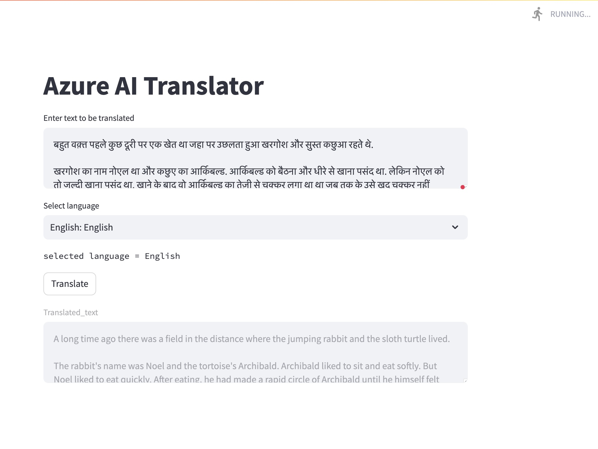

# Azure AI Speech and Translator Service App
## This repo is sample for azure AI speech and translator service

This repo creates a streamlit app to accept user text input and then a language to translate the input text then uses Azure python sdk to translate it into selected language and synthesize speech using azure speech sdk.

Here are some translation examples:
---
 - English: Hello
 - French: Bonjour
--- 
 - English: How are you?
 - Spanish: ¿Cómo estás?
---
 - English: What is your name?
 - German: Wie ist Ihr Name?
---
 - English: Where is the nearest restaurant?
 - Italian: Dove si trova il ristorante più vicino?
---
 - English: I love programming.
 - Japanese: プログラミングが大好きです。
---
 - English: Thank you very much.
 - Chinese: 非常感谢你。
---
 - English: Can you help me, please?
 - Russian: Можете ли вы мне помочь, пожалуйста?
---
 - English: Excuse me, where is the bathroom?
 - Portuguese: Com licença, onde fica o banheiro?
---
 - English: I would like a coffee, please.
 - Dutch: Mag ik een koffie alstublieft?
---
 - English: Have a nice day!
 - Swedish: Ha en trevlig dag!

 